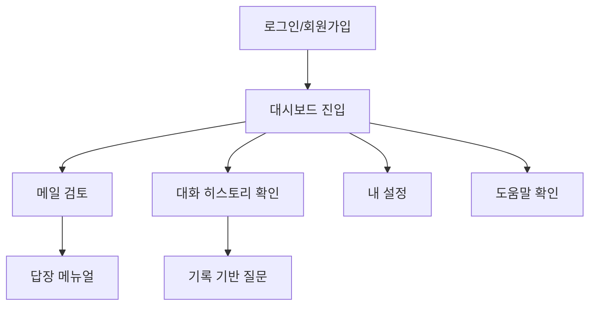

# 🧠 Information Architecture (정보 구조 문서)

---

## 📋 목차

1. [사이트맵 (Site Map)](https://www.notion.so/IA-2370d239490080f3abf7df5dff9210f7?pvs=21)
2. [사용자 흐름 (User Flow)](https://www.notion.so/IA-2370d239490080f3abf7df5dff9210f7?pvs=21)
3. [네비게이션 구조 (Navigation Structure)](https://www.notion.so/IA-2370d239490080f3abf7df5dff9210f7?pvs=21)
4. [페이지 계층 구조 (Page Hierarchy)](https://www.notion.so/IA-2370d239490080f3abf7df5dff9210f7?pvs=21)
5. [콘텐츠 구성 방식 (Content Organization)](https://www.notion.so/IA-2370d239490080f3abf7df5dff9210f7?pvs=21)
6. [인터랙션 패턴 (Interaction Patterns)](https://www.notion.so/IA-2370d239490080f3abf7df5dff9210f7?pvs=21)
7. [URL 구조 (URL Structure)](https://www.notion.so/IA-2370d239490080f3abf7df5dff9210f7?pvs=21)
8. [컴포넌트 계층 구조 (Component Hierarchy)](https://www.notion.so/IA-2370d239490080f3abf7df5dff9210f7?pvs=21)

---

## 1. 📁 사이트맵 (Site Map)

```
/
├── login → 로그인
├── dashboard → 대시보드 홈
│ ├── review → 메일 검토
│ ├── manual → 답장 메뉴얼
│ ├── history → 대화 히스토리
│ └── settings → 내 설정
└── help → 도움말 / FAQ
```

---

## 2. 🔄 사용자 흐름 (User Flow)



---

## 3. 📌 네비게이션 구조 (Navigation Structure)

- **형식:** Sidebar 좌측 고정
- **표현:** 아이콘 + 텍스트
- **반응형:** 모바일에서 햄버거 메뉴로 변경
- **접근성:** 키보드 내비게이션 / 스크린 리더 지원

| 항목명         | 경로                  | 설명                                 |
| -------------- | --------------------- | ------------------------------------ |
| 📨 메일 검토    | /dashboard/review     | 메일 붙여넣기 → 오해 여부 검토 및 결과 |
| 📝 답장 메뉴얼  | /dashboard/manual     | 상황별 AI 추천 답장 예시              |
| 📂 대화 히스토리| /dashboard/history    | 이전 주고받은 메일 검색 및 재사용     |
| ⚙️ 내 설정      | /dashboard/settings   | 알림 설정, 톤 설정 등 사용자 개인화   |
| ❓ 도움말       | /help                 | 서비스 사용법 및 FAQ                 |

---

## 4. 🗂 페이지 계층 구조 (Page Hierarchy)

```
Layout
├── Sidebar (공통)
│   ├── NavItem (아이콘 + 텍스트)
└── Main Content
    ├── ReviewPage (메일 검토)
    ├── ManualPage (답장 메뉴얼)
    ├── HistoryPage (대화 히스토리)
    ├── SettingsPage (내 설정)
    └── HelpPage (도움말)
```

---

## 5. 🧾 콘텐츠 구성 방식 (Content Organization)

| 페이지       | 주요 콘텐츠 요소                                   |
| ------------ | -------------------------------------------------- |
| 메일 검토    | 이메일 입력창, 감정/오해 분석, 표현 수정 추천      |
| 답장 메뉴얼  | 상황별 템플릿, 목적별 분류, 버튼형 추천 문장       |
| 대화 히스토리| 타임라인 리스트, 날짜/주제 필터, 재질문 기능       |
| 설정         | 알림 설정, 어조 선택, 언어 설정, 계정 관리         |
| 도움말       | 텍스트 가이드, 자주 묻는 질문, 사용자 가이드 영상 포함 |

---

## 6. 🧩 인터랙션 패턴 (Interaction Patterns)

| 유형           | 예시 설명                                              |
| -------------- | ----------------------------------------------------- |
| 폼 입력        | 이메일 복붙 후 검토 버튼 클릭                          |
| 실시간 응답    | GPT/Gemini 기반 답장 자동 생성 → 타이핑 애니메이션 출력 |
| 결과 스코어링  | 오해 점수, 감정 분석 점수 시각화                      |
| 필터링         | 히스토리에서 날짜/상대방 기준으로 정렬 가능           |
| 버튼형 문장 선택| “더 정중하게”, “간결하게 말해줘” 클릭 시 자동 수정    |

---

## 7. 🌐 URL 구조 (URL Structure)

| 페이지           | URL 경로              | 설명                        |
| ---------------- | --------------------- | --------------------------- |
| 로그인           | /login                | 로그인 또는 회원가입        |
| 대시보드 홈      | /dashboard            | 사용자 진입 후 홈           |
| 메일 검토        | /dashboard/review     | 이메일 내용 붙여넣기        |
| 답장 메뉴얼      | /dashboard/manual     | 템플릿 추천 및 문장 출력    |
| 대화 히스토리    | /dashboard/history    | 이전 메일 기록 확인         |
| 내 설정          | /dashboard/settings   | 사용자 세팅 관리            |
| 도움말 / FAQ     | /help                 | 사용 가이드 및 영상         |

- ✅ SEO 최적화: 각 페이지에 제목 (<title>)과 설명 (meta description) 추가 필요
- 📱 모바일 고려: 모든 경로는 모바일 UI에서도 동일한 주소로 접근 가능하게 설계

---

## 8. 🧱 컴포넌트 계층 구조 (Component Hierarchy)

```
<App>
└── <AuthProvider>
    └── <Router>
        └── <SidebarLayout>
            ├── <Sidebar>
            │    └── <NavItem /> x 5
            └── <MainContent>
                 ├── <ReviewForm />
                 ├── <ReviewResult />
                 ├── <ManualList />
                 ├── <HistoryTimeline />
                 ├── <SettingsPanel />
                 └── <HelpSection />
```

---

## 📱 반응형 디자인 및 접근성 고려사항

- ✅ 모바일 최소 해상도 기준 375px (iPhone SE)
- ✅ 사이드바는 모바일에서 숨김 후 햄버거 메뉴 전환
- ✅ 모든 버튼/입력창 aria-label, 키보드 Tab 접근 가능
- ✅ 어두운 배경 대비 밝은 글자 제공 (WCAG 2.1 AAA 기준 고려)

> 본 IA 문서는 실사용자를 위한 빠른 접근성과 명확한 콘텐츠 흐름을 중심으로 구성되었습니다. 직장인의 반복 업무 부담을 줄이기 위해 모든 정보 구조는 최소 클릭, 최대 맥락 전달을 목표로 설계되었습니다. 

##  현재 폴더 구조 상태

### ✅ **정상적으로 생성된 폴더들:**

**Frontend:**
```
frontend/
├── src/
│   ├── components/     ✅ 생성됨
│   └── pages/
│       └── Dashboard/  ✅ 생성됨
├── package.json
└── node_modules/
```

**Backend:**
```
backend/
├── src/
│   ├── routes/         ✅ 생성됨
│   ├── controllers/    ✅ 생성됨
│   ├── services/       ✅ 생성됨
│   ├── models/         ✅ 생성됨
│   ├── middlewares/    ✅ 생성됨
│   └── utils/          ✅ 생성됨
├── config/             ✅ 생성됨
├── package.json
└── node_modules/
```

### ❌ **누락된 폴더:**
- `docs/` 폴더가 없습니다 (삭제된 것 같습니다)

###  **추가로 필요한 폴더들:**
- `frontend/src/pages/` (Dashboard 외의 페이지들)
- `frontend/public/` (React 기본 폴더)

---

## 🛠️ **누락된 폴더들을 생성할까요?**

`docs` 폴더와 `frontend/public` 폴더를 다시 만들어드릴까요?

또는 전체 폴더 구조를 다시 한번 깔끔하게 정리해드릴 수도 있습니다.

어떻게 진행하시겠어요? 😊
